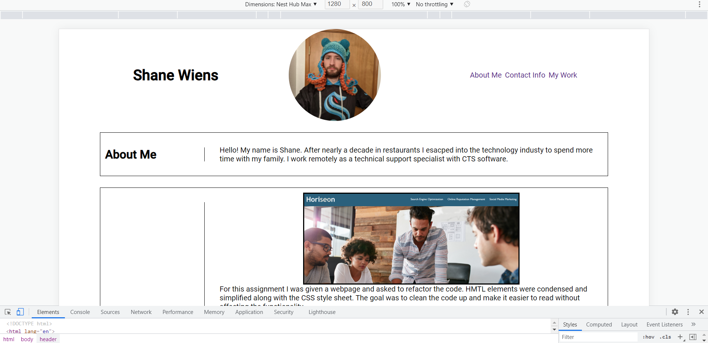

# Portfolio
This is a sample of my work, to be developed over time.

## Objective

The goal in creating this application was to attempt to apply my new CSS knowlegde along with proper HTML format usage. 
While I was mostly successful in creating and deploying the page, I was able to identify some areas for further study.
I feel comfortable creating and styling containers, but resizing for smaller screens eludes me.

## Results

So I made a thing, it's not much but it's mine. 

https://shanewiens.github.io/Portfolio/

